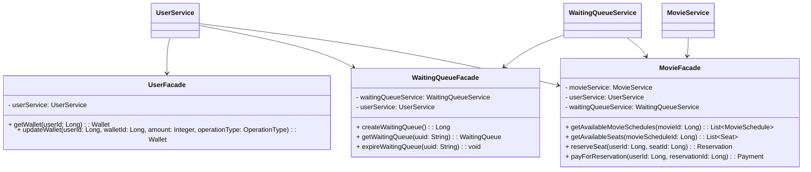
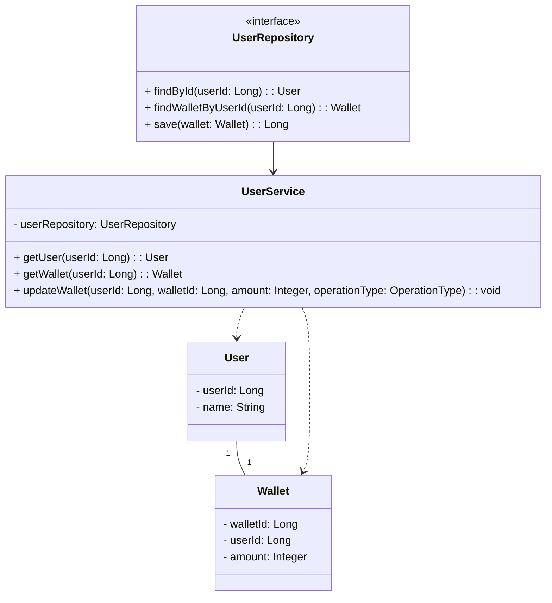
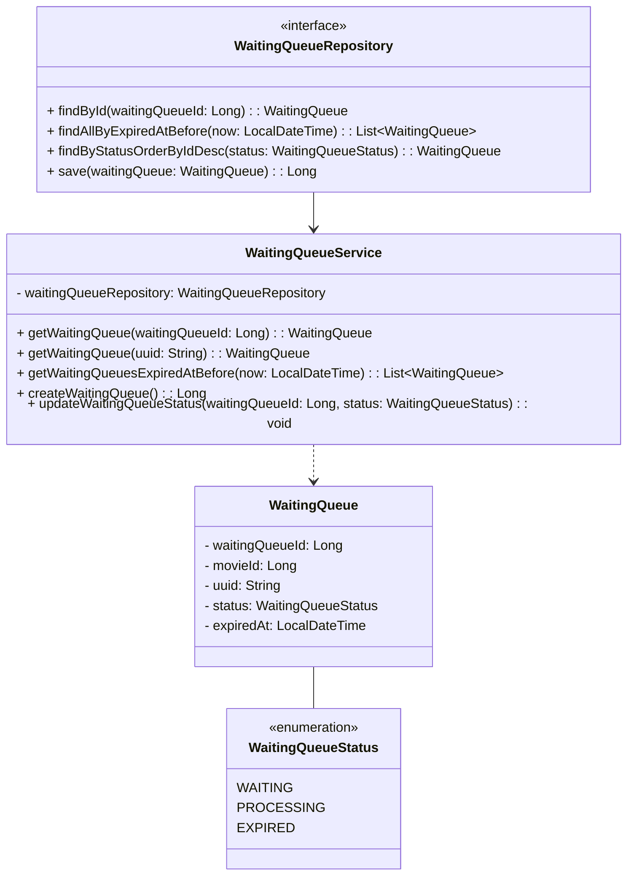
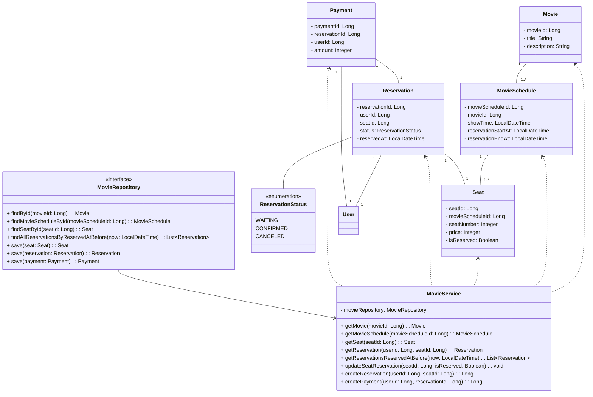

# 영화 예매 시스템 클래스 다이어그램

## 전체 클래스 다이어그램

전체 클래스 다이어그램은 주요 파사드 클래스를 중심으로 설계되었습니다. 서비스 계층과 레포지토리 계층은 각각의 도메인 설명에서 자세히 다루고 있습니다.

```mermaid
classDiagram
    class UserFacade {
        - userService: UserService
        + getWallet(userId: Long): Wallet
        + updateWallet(userId: Long, walletId: Long, amount: Integer, operationType: OperationType): Wallet
    }

    class WaitingQueueFacade {
        - waitingQueueService: WaitingQueueService
        - userService: UserService
        + createWaitingQueue(): Long
        + getWaitingQueue(uuid: String): WaitingQueue
        + expireWaitingQueue(uuid: String): void
    }

    class MovieFacade {
        - movieService: MovieService
        - userService: UserService
        - waitingQueueService: WaitingQueueService
        + getAvailableMovieSchedules(movieId: Long): List~MovieSchedule~
        + getAvailableSeats(movieScheduleId: Long): List~Seat~
        + reserveSeat(userId: Long, seatId: Long): Reservation
        + payForReservation(userId: Long, reservationId: Long): Payment
    }

    UserService --> UserFacade
    WaitingQueueService --> WaitingQueueFacade
    UserService --> WaitingQueueFacade
    MovieService --> MovieFacade
    UserService --> MovieFacade
    WaitingQueueService --> MovieFacade
```

## 유저 도메인

```mermaid
classDiagram
    class User {
        - userId: Long
        - name: String
    }

    class Wallet {
        - walletId: Long
        - userId: Long
        - amount: Integer
    }

    class UserService {
        - userRepository: UserRepository
        + getUser(userId: Long): User
        + getWallet(userId: Long): Wallet
        + updateWallet(userId: Long, walletId: Long, amount: Integer, operationType: OperationType): void
    }

    class UserRepository {
        <<interface>>
        + findById(userId: Long): User
        + findWalletByUserId(userId: Long): Wallet
        + save(wallet: Wallet): Long
    }

    User "1" -- "1" Wallet
    UserService ..> User
    UserService ..> Wallet
    UserRepository --> UserService
```

## 대기열 도메인

```mermaid
classDiagram
    class WaitingQueue {
        - waitingQueueId: Long
        - movieId: Long
        - uuid: String
        - status: WaitingQueueStatus
        - expiredAt: LocalDateTime
    }

    class WaitingQueueStatus {
        <<enumeration>>
        WAITING
        PROCESSING
        EXPIRED
    }

    class WaitingQueueService {
        - waitingQueueRepository: WaitingQueueRepository
        + getWaitingQueue(waitingQueueId: Long): WaitingQueue
        + getWaitingQueue(uuid: String): WaitingQueue
        + getWaitingQueuesExpiredAtBefore(now: LocalDateTime): List~WaitingQueue~
        + createWaitingQueue(): Long
        + updateWaitingQueueStatus(waitingQueueId: Long, status: WaitingQueueStatus): void
    }

    class WaitingQueueRepository {
        <<interface>>
        + findById(waitingQueueId: Long): WaitingQueue
        + findAllByExpiredAtBefore(now: LocalDateTime): List~WaitingQueue~
        + findByStatusOrderByIdDesc(status: WaitingQueueStatus): WaitingQueue
        + save(waitingQueue: WaitingQueue): Long
    }

    WaitingQueue -- WaitingQueueStatus
    WaitingQueueService ..> WaitingQueue
    WaitingQueueRepository --> WaitingQueueService
```

## 영화 도메인

```mermaid
classDiagram
    class Movie {
        - movieId: Long
        - title: String
        - description: String
    }

    class MovieSchedule {
        - movieScheduleId: Long
        - movieId: Long
        - showTime: LocalDateTime
        - reservationStartAt: LocalDateTime
        - reservationEndAt: LocalDateTime
    }

    class Seat {
        - seatId: Long
        - movieScheduleId: Long
        - seatNumber: Integer
        - price: Integer
        - isReserved: Boolean
    }

    class Reservation {
        - reservationId: Long
        - userId: Long
        - seatId: Long
        - status: ReservationStatus
        - reservedAt: LocalDateTime
    }

    class ReservationStatus {
        <<enumeration>>
        WAITING
        CONFIRMED
        CANCELED
    }

    class Payment {
        - paymentId: Long
        - reservationId: Long
        - userId: Long
        - amount: Integer
    }

    class MovieService {
        - movieRepository: MovieRepository
        + getMovie(movieId: Long): Movie
        + getMovieSchedule(movieScheduleId: Long): MovieSchedule
        + getSeat(seatId: Long): Seat
        + getReservation(userId: Long, seatId: Long): Reservation
        + getReservationsReservedAtBefore(now: LocalDateTime): List~Reservation~
        + updateSeatReservation(seatId: Long, isReserved: Boolean): void
        + createReservation(userId: Long, seatId: Long): Long
        + createPayment(userId: Long, reservationId: Long): Long
    }

    class MovieRepository {
        <<interface>>
        + findById(movieId: Long): Movie
        + findMovieScheduleById(movieScheduleId: Long): MovieSchedule
        + findSeatById(seatId: Long): Seat
        + findAllReservationsByReservedAtBefore(now: LocalDateTime): List~Reservation~
        + save(seat: Seat): Seat
        + save(reservation: Reservation): Reservation
        + save(payment: Payment): Payment
    }

    Movie "1" -- "1..*" MovieSchedule
    MovieSchedule "1" -- "1..*" Seat
    Reservation "1" -- "1" User
    Reservation "1" -- "1" Seat
    Reservation -- ReservationStatus
    Payment "1" -- "1" User
    Payment "1" -- "1" Reservation
    Movie <.. MovieService
    MovieSchedule <.. MovieService
    Seat <.. MovieService
    Reservation <.. MovieService
    Payment <.. MovieService
    MovieRepository --> MovieService
```

