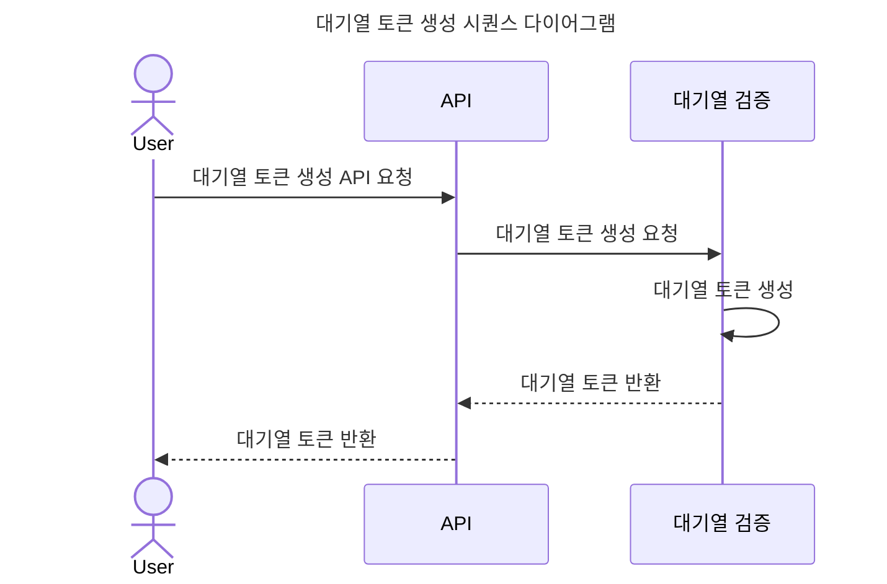
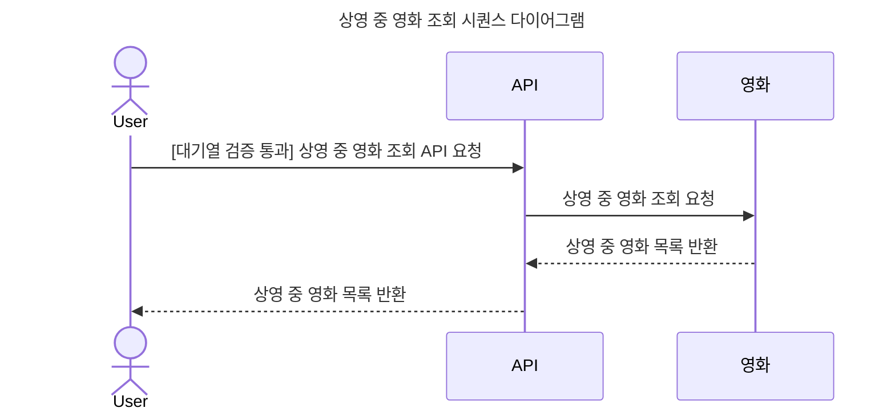
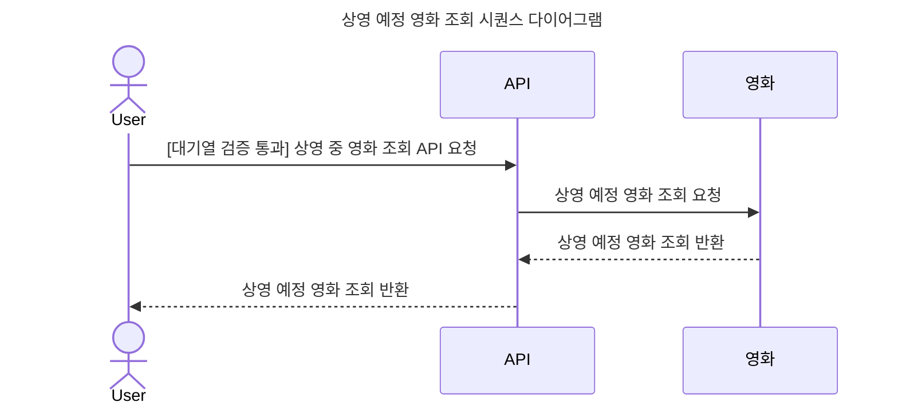
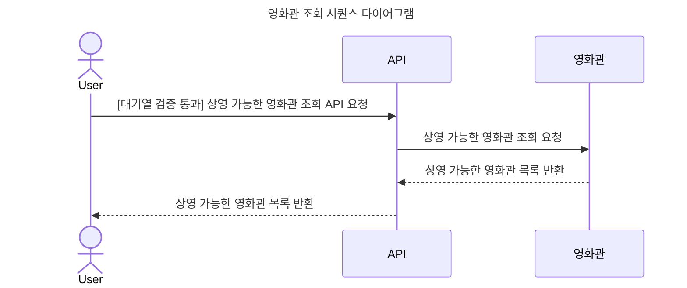
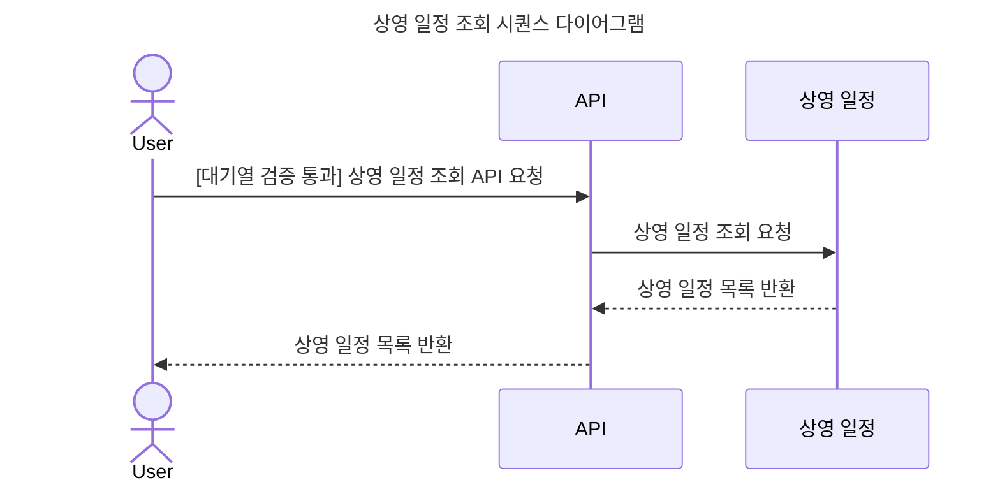
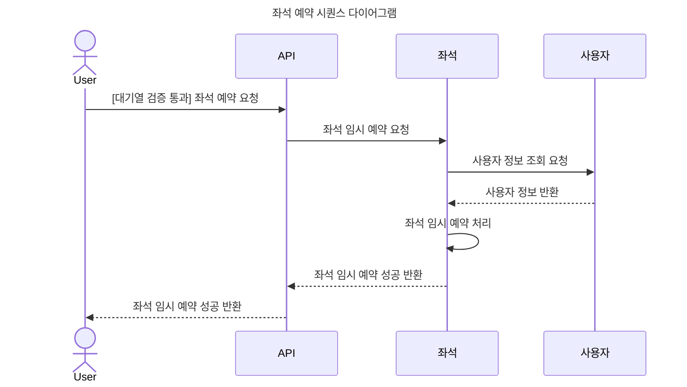
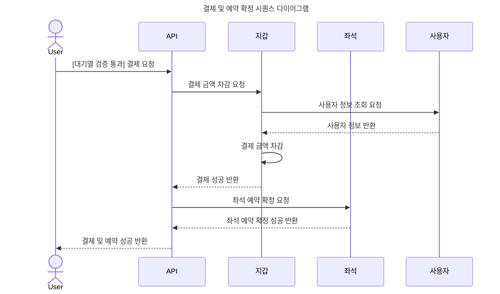

# SEQUENCE DIAGRAM

## 영화 예매 시퀀스 다이어그램

영화 예매 전체 흐름에서 성공 케이스 중심으로 시퀀스 다이어그램을 작성했습니다. 자세한 예외 처리는 각 Use Case 별 시퀀스 다이어그램을 참고하세요.
이 시퀀스 다이어그램은 영화 예매 시스템의 전체적인 흐름을 직관적으로 보여주며, 사용자 경험을 향상시키기 위해 필요한 검증 및 처리 단계를 포함하고 있습니다.

### 대기열 토큰 생성

### 상영 중 영화 조회

### 상영 예정 영화 조회

### 영화관 조회

### 상영 일정 조회

### 좌석 예약

### 결제 및 예약 확정

